# stablecoins_risk

# Collection of Plots

## Hourly Stablecoins Prices 
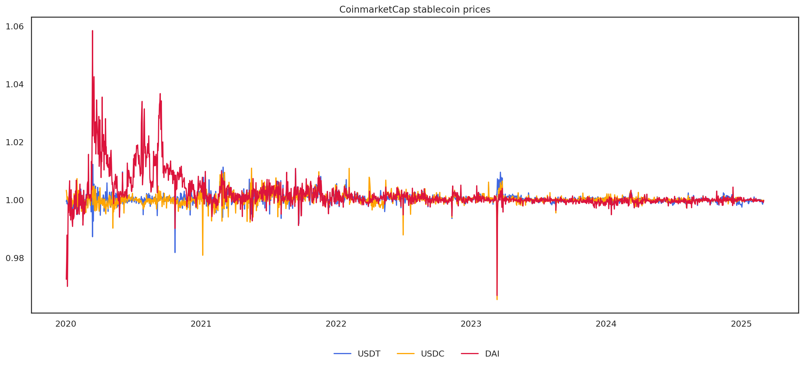
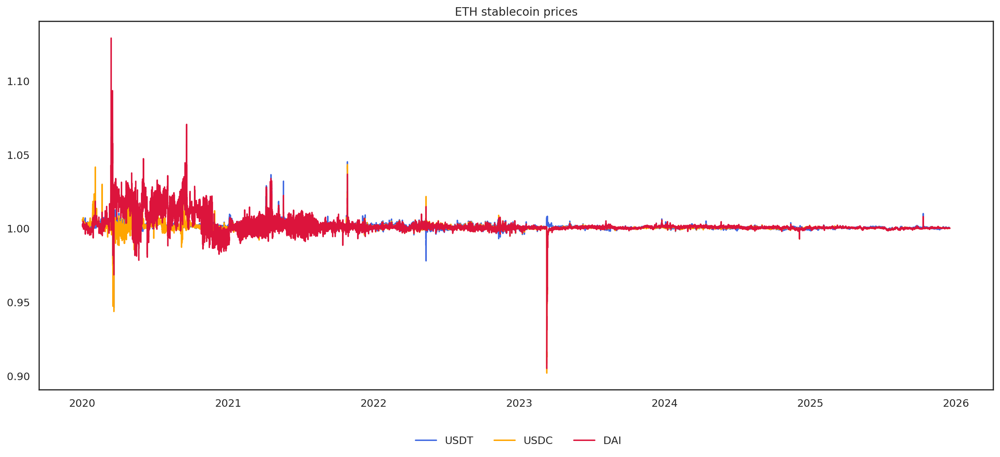
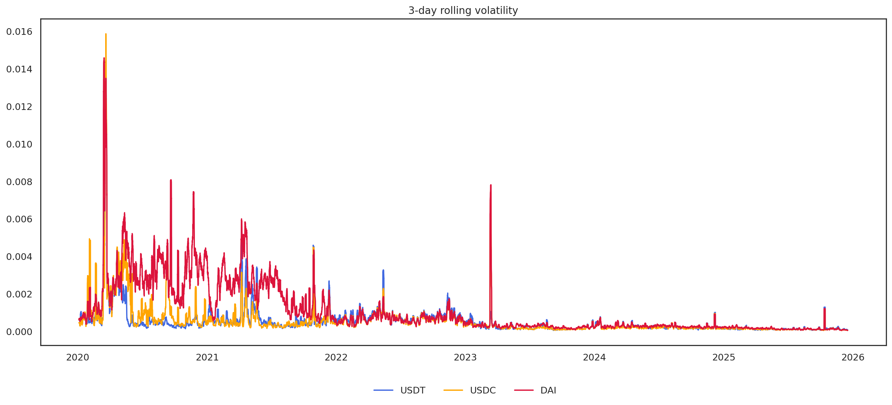

## Onchain - AMMs and stablecoins 

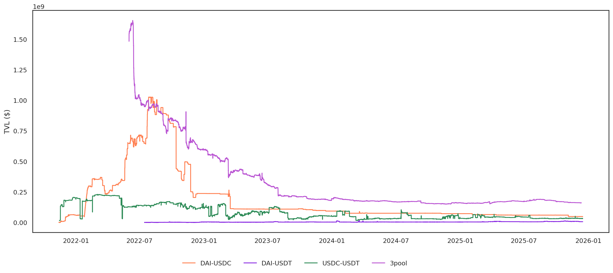

### Uniswap v3 pools 

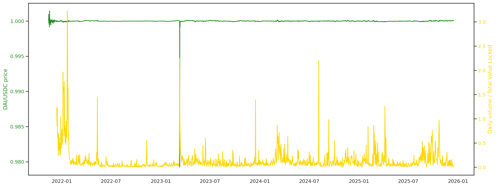
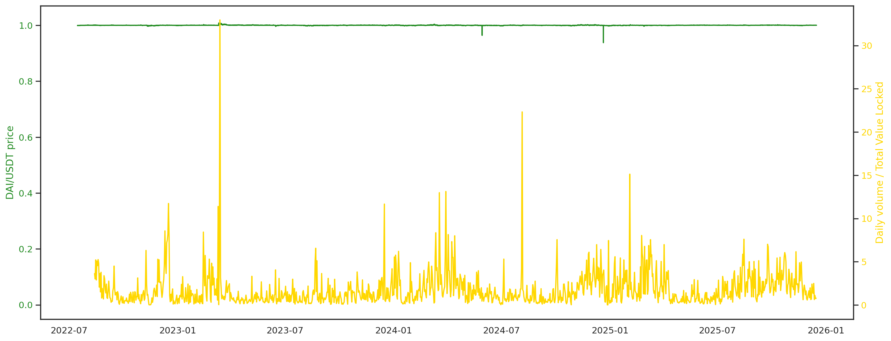
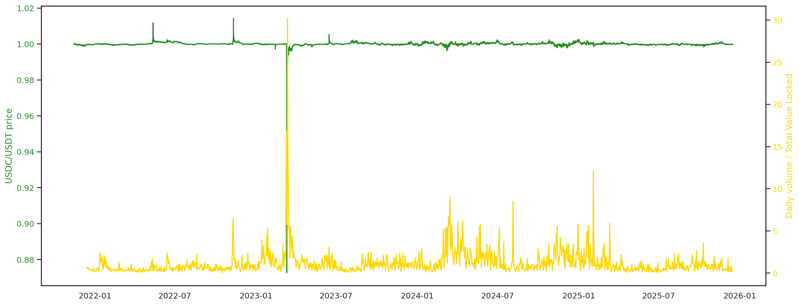

### Curve 3pool 

<iframe src="./figures/crv_balance.html"
        width="100%" height="700" frameborder="0"></iframe>

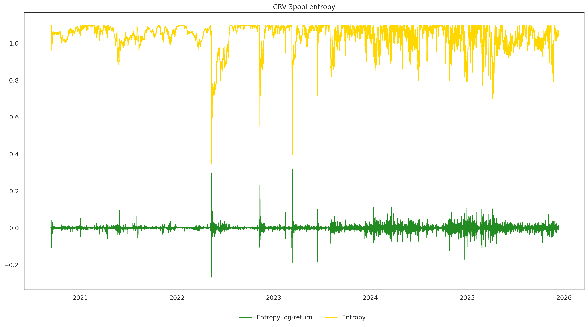

## Onchain - AAVE Lending Protocol 
### V3
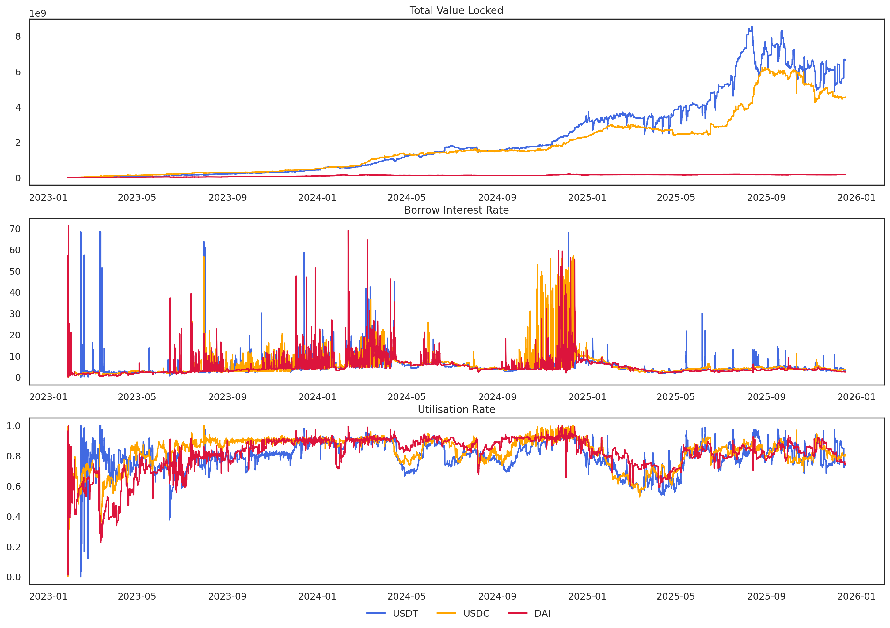
### V2
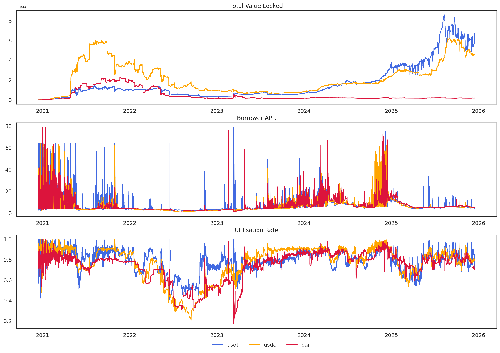
### Liquidation
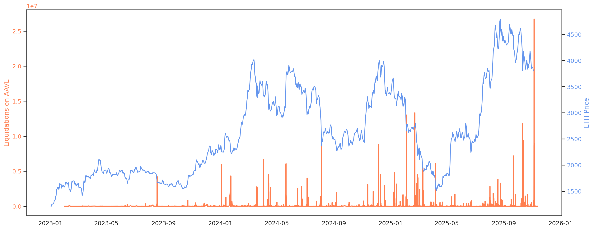

## Mints and Burns - Circulating supply variation

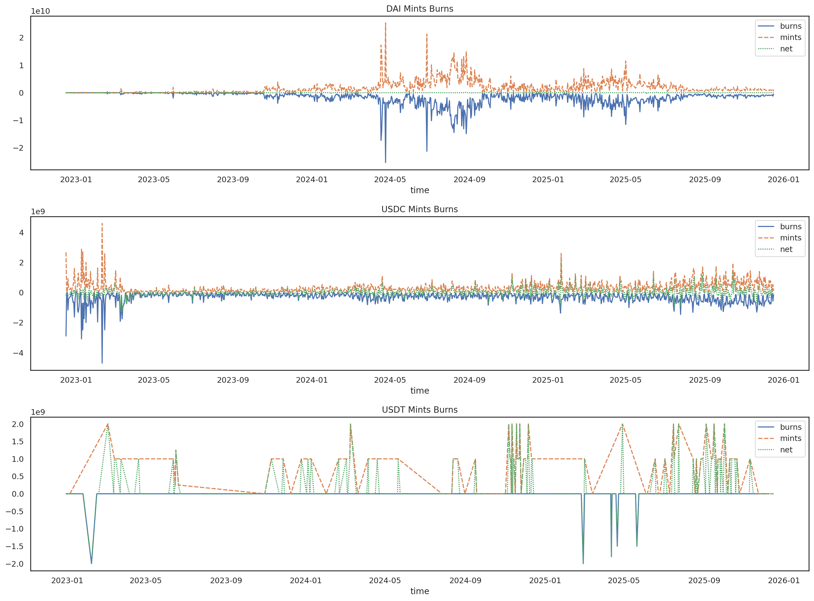
